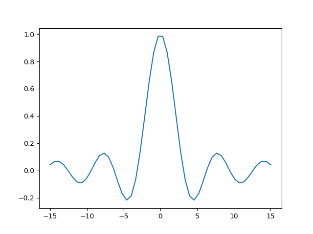

- [Toetsaanslagen](#orgfbabe41)
- [Te doen <code>[1/2]</code>](#org42db647)
  - [MarColumn december schrijven <code>[6/6]</code>](#org42c460a)
  - [File met voorbeelden toevoegen <code>[4/5]</code>](#org5c58935)
    - [Takenlijst <code>[37%]</code>](#org6141d9f)
    - [Links](#orge75df8a)
    - [Tabel/spreadsheet](#orgc10c700)
    - [Formule](#org08ffef7)
    - [Code](#org8276de2)


<a id="orgfbabe41"></a>

# Toetsaanslagen

1.  Ik gebruik kleine letter `a` voor de `A`-toets.
2.  Ik gebruik hoofdletters `C-` voor de `Ctrl`-toets, `M-` voor de Alt (meta)-toets en `S-` voor de `Shift`-toets.
    -   `C-c` is dus `Ctrl-C`, `C-c C-c` is dat tweemaal en `C-M-a` is gelijktijdig `Ctrl`, `Alt` en `A` indrukken.
3.  `ENTER`, `TAB` en `ESC` zijn de toetsen die je verwacht.
4.  Raak je verstrikt? Druk `ESC ESC ESC ESC` en je kunt weer typen.
5.  Zie ook <http://pub.vandersluys.nl/download/GettingStartedWithEmacs.pdf> (met name sectie 1.2 en het begin van 1.3)


<a id="org42db647"></a>

# TODO Te doen <code>[1/2]</code>


<a id="org42c460a"></a>

## DONE MarColumn december schrijven <code>[6/6]</code>

1.  [X] klokken taken, projecten
2.  [X] agenda, plannen, takenlijsten (TODO/DONE, OPEN/CLOSED), ideeenlijsten
3.  [X] (interne) links
4.  [X] tabellen, simpele spreadsheets
5.  [X] export, publish: plain text, html, md, LaTeX/PDF, odt, rST, &#x2026;
6.  [X] code, formules


<a id="org5c58935"></a>

## TODO File met voorbeelden toevoegen <code>[4/5]</code>


<a id="org6141d9f"></a>

### DONE Takenlijst <code>[37%]</code>

-   [X] Zie [2](#org42db647)
-   [X] inspringen:
    -   zet de cursor op een item en typ `Alt-pijl rechts/links`
    -   hetzelfde voor kopjes
-   [ ] slepen:
    -   zet de cursor op een item en typ `Alt-pijl op/neer`
    -   op/neer wisselt voor een item (met dezelfde indentatie en indien mogelijk)
    -   hetzelfde voor kopjes (van hetzelfde level)
-   [ ] lijstsymbool veranderen:
    -   zet de cursor op een item en typ `Shift rechts/links`
    -   symbolen springen van tussen `+/-/*/1./1)` (`*` indien mogelijk)
-   [X] item aan/uitvinken:
    -   zet de cursor op het item en typ `C-c C-c`
    -   het aantal of percentage in het kopje erboven (gemaakt door `[/]` of `[%]` te typen) verandert mee
-   [ ] TODO veranderen:
    -   zet de cursor op een kopje en typ `Shift rechts/links`
    -   als alle subkopjes DONE zijn, wordt het hogere kopje dat ook (mits er TODO staat)
-   [ ] Nieuw item:
    -   `Alt-ENTER`
-   [ ] Nieuw kopje:
    -   `Ctrl-ENTER`


<a id="orge75df8a"></a>

### DONE Links

-   Interne link: zie [2](#org42db647)
-   Externe link: <https://github.com/MarcvdSluys/NLLGG-docs>
-   Externe link met onschrijving: [NLLGG docs](https://github.com/MarcvdSluys/NLLGG-docs)


<a id="orgc10c700"></a>

### DONE Tabel/spreadsheet

1.  typ `|- TAB` voor een horizontale lijn
2.  typ `x|x^2|x^3 TAB` in de nieuwe regel voor de header
3.  typ `-` rechts tegen de `|` voor nog een lijn
4.  in de linker kolom, typ `1 ENTER 2 ENTER` etc.
5.  onder x<sup>2</sup>, typ `=$1**2 TAB`. `$1` staat voor kolom 1.
6.  onder x<sup>3</sup>, typ `=$1**3 TAB`
7.  ga naar de regel met `TBLFM` (tabelformule) onder de tabel en typ `C-c C-c`

| x | x<sup>2</sup> | x<sup>3</sup> |
| 1 | 1             | 1             |
| 2 | 4             | 8             |
| 3 | 9             | 27            |
| 4 | 16            | 64            |
| 5 | 25            | 125           |


<a id="org08ffef7"></a>

### DONE Formule

LaTeX moet geinstalleerd zijn&#x2026;

1.  inline: typ `$\int_0^\infty \frac{\sin x}{x} dx$` en druk `Ctrl-C Ctrl-X Ctrl-L` Dit is een mooie formule $\int_0^\infty \frac{\sin x}{x} dx$, maar wel ingewikkeld.

2.  tussen de tekst: typ `\[\int_0^\infty \frac{\sin x}{x} dx\]` en druk `Ctrl-C Ctrl-X Ctrl-L` $$\int_0^\infty \frac{\sin x}{x} dx$$


<a id="org8276de2"></a>

### ACTIVE Code

Werkt altijd?

1.  Elisp (emacs lisp script)

    1.  Typ `C-c C-, s` voor een `#+begin/end_src`-block en voeg zelf `elisp` toe
    2.  Typ wat code en return een waarde
    3.  In het codeblok, typ `C-c C-c` en beantwoord de vraag onderin met `yes ENTER`
    4.  Het resultaat verschijnt in een `RESULTS`-blok onder de code.
    
    ```elisp
    (concat  (emacs-version)
    	 "\nOrgmode " (org-version))  
    ```

2.  Bash

    Bash moet geinstalleerd zijn en Babel moet geactiveerd zijn voor Bash&#x2026;
    
    ```bash
    echo "Mijn homedirectory is $HOME"
    ```

3.  Python

    Python moet geinstalleerd zijn en Babel moet geactiveerd zijn voor Python&#x2026;
    
    1.  Typ `C-c C-, s` voor een `#+begin/end_src`-block en voeg zelf `python` toe
    2.  Typ wat code en return een waarde
    3.  In het codeblok, typ `C-c C-c` en beantwoord de vraag onderin met `yes ENTER`
    4.  De returnwaarde verschijnt onder de code in
    
    ```python
    x=3
    y=4
    z=x*y
    return z
    ```
    
    ```python
    import numpy as np
    import matplotlib.pyplot as plt
    x = np.linspace(-15,15)
    plt.plot(x, np.sin(x)/x)
    plt.savefig('2021-12__Orgmode_voorbeeld.png')
    return '2021-12__Orgmode_voorbeeld.png'  # Return filename to orgmode
    ```
    
    

4.  Python + Bash

    -   Hier gejat: <https://jherrlin.github.io/posts/emacs-orgmode-source-code-blocks/>
    
    Print een lijst met .org files van voor oktober in de huidige directory in bash. Ik wil zowel (`both`) de code als het resultaat exporteren (naar bijvoorbeeld .md of .pdf). En ik geef de code een naam (`ls`) zodat de output hieronder gebruikt kan worden:
    
    ```bash
    ls -la 2021-0*.org
    ```
    
        -rw-r--r-- 1 sluys sluys 2873 Jan 17  2021 2021-01__FOSSvsCommercieel.org
        -rw-r--r-- 1 sluys sluys 4069 Apr 19  2021 2021-04__GentooLinux.org
        -rw-r--r-- 1 sluys sluys 3973 Jun 13 10:57 2021-07__Ongedierte.org
        -rw-r--r-- 1 sluys sluys 4908 Jul 25 16:24 2021-08__FOSSopScholen.org
    
    Gebruik awk om de filename en grootte te nemen en maak een tabel:
    
    ```awk
    BEGIN { OFS="|" }; { print $9, $5}
    ```
    
    | 2021-01\_<sub>FOSSvsCommercieel.org</sub> | 2873 |
    | 2021-04\_<sub>GentooLinux.org</sub>       | 4069 |
    | 2021-07\_<sub>Ongedierte.org</sub>        | 3973 |
    | 2021-08\_<sub>FOSSopScholen.org</sub>     | 4908 |
    
    Gebruik Python om o.a. de kleinste en grootste file te vinden:
    
    ```python
    print(table[0])                      # Eerste rij van de tabel zoals ingelezen
    print("Aantal columns: %i" % len(table))
    print("Kortste column: %s (%i b)" % tuple(min(table)))
    print("Langste column: %s (%i b)" % tuple(max(table)))
    print("Totale grootte: %0.3f kb"  % (sum([x for y,x in table]) / 1000))
    ```
    
        ['2021-01__FOSSvsCommercieel.org', 2873]
        Aantal columns: 4
        Kortste column: 2021-01__FOSSvsCommercieel.org (2873 b)
        Langste column: 2021-08__FOSSopScholen.org (4908 b)
        Totale grootte: 15.823 kb
