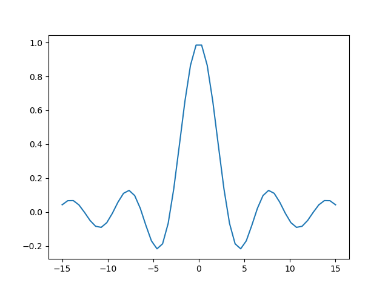

=================
Orgmode voorbeeld
=================

    :Author: Marc van der Sluys

.. contents::

1 Toetsaanslagen
----------------

1. Ik gebruik kleine letter ``a`` voor de ``A``-toets.

2. Ik gebruik hoofdletters ``C-`` voor de ``Ctrl``-toets, ``M-`` voor de Alt (meta)-toets en ``S-`` voor de
   ``Shift``-toets.

   - ``C-c`` is dus ``Ctrl-C``, ``C-c C-c`` is dat tweemaal en ``C-M-a`` is gelijktijdig ``Ctrl``, ``Alt`` en ``A``
     indrukken.

3. ``ENTER``, ``TAB`` en ``ESC`` zijn de toetsen die je verwacht.

4. Raak je verstrikt?  Druk ``ESC ESC ESC ESC`` en je kunt weer typen.

5. Zie ook `http://pub.vandersluys.nl/download/GettingStartedWithEmacs.pdf <http://pub.vandersluys.nl/download/GettingStartedWithEmacs.pdf>`_ (met name sectie 1.2 en het begin
   van 1.3)

2 TODO Te doen [1/3]
--------------------

2.1 DONE MarColumn december schrijven [6/6]
~~~~~~~~~~~~~~~~~~~~~~~~~~~~~~~~~~~~~~~~~~~

1) ☑ klokken taken, projecten

2) ☑ agenda, plannen, takenlijsten (TODO/DONE, OPEN/CLOSED), ideeenlijsten

3) ☑ (interne) links

4) ☑ tabellen, simpele spreadsheets

5) ☑ export, publish: plain text, html, md, LaTeX/PDF, odt, rST, ...

6) ☑ code, formules

2.2 PROGRESS File met eenvoudige voorbeelden toevoegen [5/6]
~~~~~~~~~~~~~~~~~~~~~~~~~~~~~~~~~~~~~~~~~~~~~~~~~~~~~~~~~~~~

2.2.1 DONE Tekststijl
^^^^^^^^^^^^^^^^^^^^^

- **vet**

- *cursief*

- onderlijnd

- doorgehaald

- ``code`` of ``vebatim``

2.2.2 DONE Takenlijst en kopjes [33%]
^^^^^^^^^^^^^^^^^^^^^^^^^^^^^^^^^^^^^

- ☑ Zie `2 TODO Te doen [1/3]`_

- ☑ inspringen:

  - zet de cursor op een item (b.v. in deze lijst) en typ ``Alt-pijl rechts/links``

  - hetzelfde voor kopjes

- ☐ slepen:

  - zet de cursor op een item en typ ``Alt-pijl op/neer``

  - op/neer wisselt voor een item (met dezelfde indentatie en indien mogelijk)

  - hetzelfde voor kopjes (van hetzelfde level)

- ☐ lijstsymbool veranderen:

  - zet de cursor op een item en typ ``Shift rechts/links``

  - symbolen springen van tussen ``+/-/*/1./1)`` (``\*`` indien mogelijk)

- ☑ item aan/uitvinken:

  - zet de cursor op het item en typ ``C-c C-c``

  - het aantal of percentage in het kopje erboven (gemaakt door ``[/]`` of ``[%]`` te typen) verandert mee

- ☐ TODO veranderen:

  - zet de cursor op een kopje en typ ``Shift rechts/links``

  - als alle subkopjes DONE zijn, wordt het hogere kopje dat ook (mits er TODO staat)

- ☐ Nieuw item:

  - ``Alt-ENTER``

- ☐ Nieuw kopje:

  - ``Ctrl-ENTER``

- ☐ Nieuwe lijst maken

  1) Genummerd:

     1. typ een ``1.`` of ``1)`` gevolgd door een spatie en de omschrijving

     2. typ ``Alt-ENTER`` voor het volgende item (telt automatisch door)

  2) Ongenummerd:

     1. typ een ``+``, ``-`` of (indien subitem) ``\*`` gevolgd door een spatie en de omschrijving

     2. typ ``Alt-ENTER`` voor het volgende item met hetzelfde symbool

  3) Definitie:

     Definitie
         een definitie is een **ongenummerd** item met een keyword, gevolgd door een dubbele dubbele
         punt (``::``) en de definitie.

     - ``Alt-ENTER`` vraagt om de volgende definitie met hetzelfde symbool

  4) Vink (*radio button*):

     1. typ een item symbool of nummer, gevolgd door een spatie, ``[ ]``, weer een spatie en de omschrijving

     2. de ``[ ]`` licht op ten teken dat de *radio button* actief is

     3. ``Alt-ENTER`` geeft een nieuw item, maar **geen** lege radio button (bug?)

     4. ``C-c C-c`` op de regel switcht tussen ``[ ]`` en ``[X]``

2.2.3 DONE Links
^^^^^^^^^^^^^^^^

- Interne link: zie `2 TODO Te doen [1/3]`_

- Externe link: `https://github.com/MarcvdSluys/NLLGG-docs <https://github.com/MarcvdSluys/NLLGG-docs>`_

- Externe link met onschrijving: `NLLGG docs <https://github.com/MarcvdSluys/NLLGG-docs>`_

2.2.4 DONE Tabel/spreadsheet
^^^^^^^^^^^^^^^^^^^^^^^^^^^^

1. typ ``|- TAB`` voor een horizontale lijn

2. typ ``x|x^2|x^3 TAB`` in de nieuwe regel voor de header

3. typ ``-`` rechts tegen de ``|`` voor nog een lijn

4. in de linker kolom, typ ``1 ENTER 2 ENTER`` etc.

5. onder x\ :sup:`2`\, typ ``=$1**2 TAB``.  ``$1`` staat voor kolom 1.

6. onder x\ :sup:`3`\, typ ``=$1**3 TAB``

7. ga naar de regel met ``TBLFM`` (tabelformule) onder de tabel en typ ``C-c C-c``

.. table::

    +---+--------------+--------------+
    | x | x\ :sup:`2`\ | x\ :sup:`3`\ |
    +===+==============+==============+
    | 1 |            1 |            1 |
    +---+--------------+--------------+
    | 2 |            4 |            8 |
    +---+--------------+--------------+
    | 3 |            9 |           27 |
    +---+--------------+--------------+
    | 4 |           16 |           64 |
    +---+--------------+--------------+
    | 5 |           25 |          125 |
    +---+--------------+--------------+

2.3 PROGRESS Meer geavanceerde voorbeelden
~~~~~~~~~~~~~~~~~~~~~~~~~~~~~~~~~~~~~~~~~~

2.3.1 DONE Formule
^^^^^^^^^^^^^^^^^^

LaTeX moet geinstalleerd zijn...

1. inline: typ ``$\int_0^\infty \frac{\sin x}{x} dx$`` en druk ``C-c C-x C-l``
   Dit is een mooie formule :math:`\int_0^\infty \frac{\sin x}{x} dx`, maar wel ingewikkeld.

2. tussen de tekst: typ ``\[\int_0^\infty \frac{\sin x}{x} dx\]`` en druk ``C-c C-x C-l``

   .. math::

       \int_0^\infty \frac{\sin x}{x} dx

2.3.2 ACTIVE Code
^^^^^^^^^^^^^^^^^

- Elisp werkt altijd?

2.3.2.1 Elisp (emacs lisp script)
:::::::::::::::::::::::::::::::::

1. Typ ``C-c C-, s`` voor een ``#+begin/end_src``-block en voeg zelf ``elisp`` toe

2. Typ wat code en return een waarde

3. In het codeblok, typ ``C-c C-c`` en beantwoord de vraag onderin met ``yes ENTER``

4. Het resultaat verschijnt in een ``RESULTS``-blok onder de code.

.. code:: elisp

    (concat  (emacs-version)
    	 "\nOrgmode " (org-version))  

::

    GNU Emacs 27.2 (build 1, x86_64-pc-linux-gnu, GTK+ Version 3.24.29, cairo version 1.16.0)
     of 2021-10-01
    Orgmode N/A

2.3.2.2 Bash
::::::::::::

Bash moet geinstalleerd zijn en Babel moet geactiveerd zijn voor Bash...

.. code:: bash

    echo "Mijn homedirectory is $HOME"

::

    Mijn homedirectory is /home/sluys

2.3.2.3 Python
::::::::::::::

Python moet geinstalleerd zijn en Babel moet geactiveerd zijn voor Python...

1. Typ ``C-c C-, s`` voor een ``#+begin/end_src``-block en voeg zelf ``python`` toe

2. Typ wat code en return een waarde

3. In het codeblok, typ ``C-c C-c`` en beantwoord de vraag onderin met ``yes ENTER``

4. De returnwaarde verschijnt onder de code in

.. code:: python
    :name: som

    x=3
    y=4
    z=x*y
    return z

::

    12

.. code:: python

    import numpy as np
    import matplotlib.pyplot as plt
    x = np.linspace(-15,15)
    plt.plot(x, np.sin(x)/x)
    plt.savefig('Orgmode_voorbeeld.png')
    return 'Orgmode_voorbeeld.png'  # Return filename to orgmode

2.3.2.4 Python + Bash
:::::::::::::::::::::

- Hier gejat: `https://jherrlin.github.io/posts/emacs-orgmode-source-code-blocks/ <https://jherrlin.github.io/posts/emacs-orgmode-source-code-blocks/>`_

Print een lijst met een selectie van files in deze directory in bash.  Ik wil zowel (``both``) de code als het
resultaat exporteren (naar bijvoorbeeld .md of .pdf).  En ik geef de code een naam (``ls``) zodat de output
hieronder gebruikt kan worden:

.. code:: bash
    :name: ls

    ls -lb Orgmode_voorbeeld[._]*

::

    -rw-r--r-- 1 sluys sluys   8827 Dec 12 11:11 Orgmode_voorbeeld_ascii.txt
    -rw-r--r-- 1 sluys sluys  27250 Dec 12 11:50 Orgmode_voorbeeld.html
    -rw-r--r-- 1 sluys sluys   9414 Dec 12 11:59 Orgmode_voorbeeld.md
    -rw-r--r-- 1 sluys sluys  37244 Dec 12 12:00 Orgmode_voorbeeld.odt
    -rw-r--r-- 1 sluys sluys   8480 Dec 12 11:59 Orgmode_voorbeeld.org
    -rw-r--r-- 1 sluys sluys 308254 Dec 12 12:00 Orgmode_voorbeeld.pdf
    -rw-r--r-- 1 sluys sluys  23293 Dec 12 12:01 Orgmode_voorbeeld.png
    -rw-r--r-- 1 sluys sluys   9639 Dec 12 11:10 Orgmode_voorbeeld.rst
    -rw-r--r-- 1 sluys sluys  12052 Dec 12 12:00 Orgmode_voorbeeld.tex
    -rw-r--r-- 1 sluys sluys  10348 Dec 12 11:12 Orgmode_voorbeeld_utf8.txt

Gebruik awk om de filename en grootte te nemen van de files uit ``ls`` en maak een tabel:

.. code:: awk
    :name: awk

    BEGIN { OFS="|" }; { print $5, $9}

.. table::

    +--------+------------------------------------------------+
    |   8827 | Orgmode\ :sub:`voorbeeld`\ \ :sub:`ascii.txt`\ |
    +--------+------------------------------------------------+
    |  27250 | Orgmode\ :sub:`voorbeeld.html`\                |
    +--------+------------------------------------------------+
    |   9414 | Orgmode\ :sub:`voorbeeld.md`\                  |
    +--------+------------------------------------------------+
    |  37244 | Orgmode\ :sub:`voorbeeld.odt`\                 |
    +--------+------------------------------------------------+
    |   8480 | Orgmode\ :sub:`voorbeeld.org`\                 |
    +--------+------------------------------------------------+
    | 308254 | Orgmode\ :sub:`voorbeeld.pdf`\                 |
    +--------+------------------------------------------------+
    |  23293 | Orgmode\ :sub:`voorbeeld.png`\                 |
    +--------+------------------------------------------------+
    |   9639 | Orgmode\ :sub:`voorbeeld.rst`\                 |
    +--------+------------------------------------------------+
    |  12052 | Orgmode\ :sub:`voorbeeld.tex`\                 |
    +--------+------------------------------------------------+
    |  10348 | Orgmode\ :sub:`voorbeeld`\ \ :sub:`utf8.txt`\  |
    +--------+------------------------------------------------+

Gebruik Python om o.a. de kleinste en grootste file te vinden in de tabel van ``awk``:

.. code:: python

    print(table[0])                      # Eerste rij van de tabel zoals ingelezen
    print("Aantal bestanden: %i"         % len(table))
    print("Kleinste bestand: (%i b) %s"  % tuple(min(table)))
    print("Grootste bestand: (%i b) %s"  % tuple(max(table)))
    print("Totale grootte: %0.3f kb"     % (sum([x for x,y in table]) / 1000))

::

    [8827, 'Orgmode_voorbeeld_ascii.txt']
    Aantal bestanden: 10
    Kleinste bestand: (8480 b) Orgmode_voorbeeld.org
    Grootste bestand: (308254 b) Orgmode_voorbeeld.pdf
    Totale grootte: 454.801 kb
